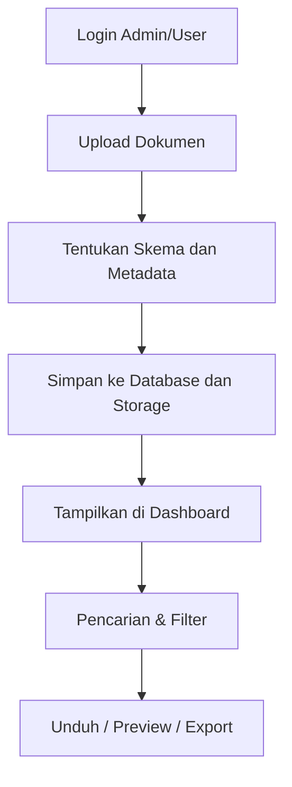

<p align="center"><a href="https://laravel.com" target="_blank"></a></p>

# Mengenai laravel {#mengenai-laravel}

Laravel adalah kerangka kerja aplikasi web dengan sintaks yang ekspresif dan elegan. Kami percaya bahwa pengembangan harus menjadi pengalaman yang menyenangkan dan kreatif agar benar-benar memuaskan. Laravel menghilangkan rasa sakit dari pengembangan dengan memudahkan tugas-tugas umum yang digunakan dalam banyak proyek web.

## Laravel Setup (Quick Guide)

Ini adalah panduan singkat untuk menjalankan proyek Laravel dari GitHub tanpa mengganggu dokumentasi utama.

### Clone Proyek dari GitHub

```bash
git clone https://github.com/username/nama-proyek.git
cd nama-proyek
```

---

# Project Digitalisasi Dokumen {#pengenalan-digitalisasi-dokumen}

Proyek ini bertujuan untuk mengelola proses digitalisasi dokumen secara efisien, mulai dari upload, penyimpanan metadata, hingga pencarian berbasis skema dan atribut tertentu. Cocok digunakan untuk instansi, perusahaan, maupun kebutuhan personal.

---

## Fitur Utama {#fitur-digitalisasi-dokumen}

- ✅ Upload dokumen (PDF, DOCX, gambar, dll)
- 🗂️ Kategori dokumen berdasarkan skema
- 🧩 Skema dinamis (custom field)
- 🔍 Pencarian dan filter berdasarkan metadata
- 🔐 Otentikasi pengguna (admin & user)
- 🧾 Export hasil dalam format Excel, CSV, dan PDF
- 🔄 Tracking revisi dokumen
- 🗑️ Soft delete & restore dokumen

---

## Alur Kerja Sistem {#alur-digitalisasi-dokumen}



## Kontributor: {#kontributor-digitalisasi-dokumen)
- (Ahmad Zaid)[https://github.com/Ahmad0126/] sebagai Sistem analist, debugger, dan fullstack web developer
- (Zaid Izzah Nurbaain)[https://github.com/Zaidizzah/] sebagai Sistem analist, debugger, dan fullstack web developer

---

## Link cepat
- [Mengenai laravel](#mengenai-laravel)
- [Pengenalan digitalisasi dokumen](#pengenalan-digitalisasi-dokumen)
- [Fitur aplikasi digitalisasi dokumen](#fitur-digitalisasi-dokumen)
- [Alur kerja sistem digitalisasi dokumen](#alur-digitalisasi-dokumen)
- [Kontibutor project digitalisasi dokumen](#kontributor-digitalisasi-dokumen)
